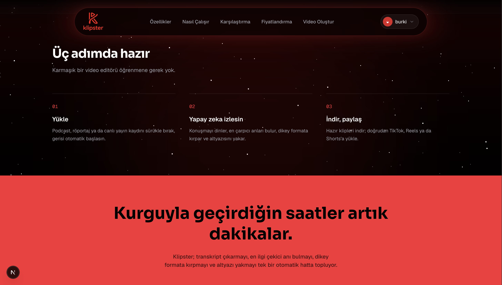
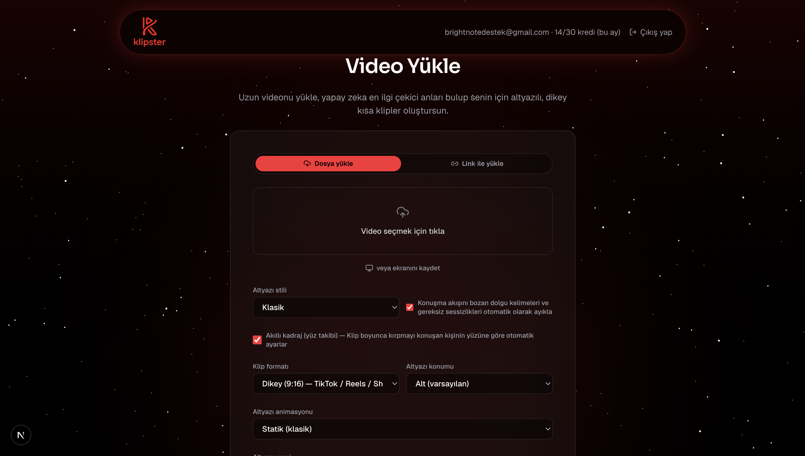
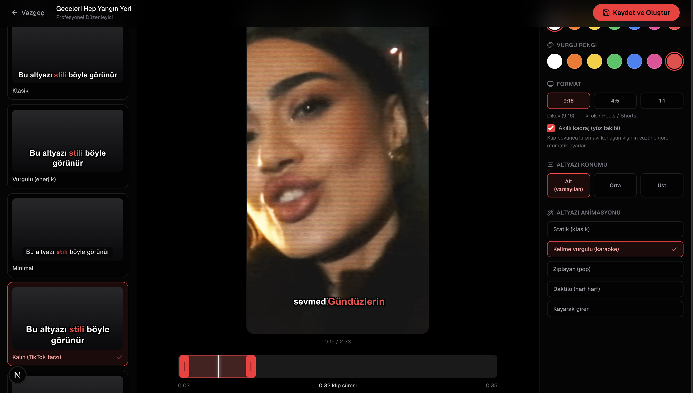
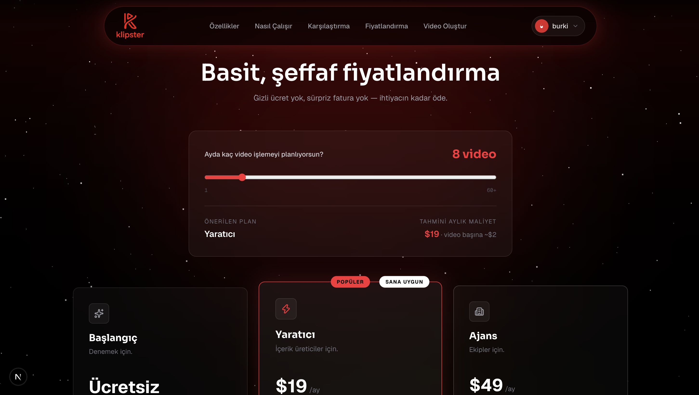

# Klipster


**Uzun videoyu yükle, yapay zeka en çarpıcı anları bulup senin yerine altyazılı, dikey (9:16) sosyal medya klipleri üretsin.**

Podcast, röportaj, canlı yayın veya ekran kaydı gibi uzun içerikleri; TikTok, Instagram Reels ve YouTube Shorts için hazır, altyazılı ve düzenlenebilir kısa kliplere dönüştüren uçtan uca bir SaaS ürünü. Full-stack olarak tek başıma geliştirdim: kimlik doğrulama ve ekip/organizasyon yönetiminden, ses tanıma ve LLM tabanlı içerik analizine, ffmpeg video işleme hattına ve CapCut tarzı bir web editörüne kadar tüm katmanlar bu repoda.

> Bu repo bir portföy/CV projesi olarak paylaşılmaktadır. Ürün ticarileştirme aşamasında olduğu için **private** tutulmaktadır.

## Ekran görüntüleri

<p>
  
</p>

| Video yükleme | Profesyonel klip editörü |
|---|---|
|  |  |

<p>
  
</p>

---

## Ürün ne yapıyor

1. **Video yükle** — bilgisayardan dosya olarak, ya da doğrudan bir YouTube/video linki yapıştırarak (`yt-dlp` ile sunucu tarafında indirilir, aynı işlem hattından geçer).
2. **Konuşma metne dönüştürülür** — `faster-whisper` ile kelime bazlı zaman damgalarıyla transkript çıkarılır, dil otomatik tespit edilir.
3. **Yapay zeka en çarpıcı anları bulur** — transkript bir LLM'e (Claude veya Gemini, `AI_PROVIDER` ile seçilebilir) gönderilir; her klip adayı için başlangıç/bitiş, başlık, neden ilgi çekici olduğu ve 0-100 arası viral potansiyel skoru üretilir.
4. **Klipler otomatik kesilip düzenlenir** — `ffmpeg` ile dolgu kelimeler/uzun sessizlikler temizlenir, seçilen en-boy oranına (9:16 / 4:5 / 1:1) kırpılır, kapak görseli üretilir.
5. **Altyazı yakılır** — 6 görsel stil (Klasik, Vurgulu, Minimal, Kalın/TikTok, Editöryel, Vintage) × 5 animasyon modu (statik, kelime vurgulu karaoke, zıplayan/pop, daktilo, kayarak giren) kombinasyonu, kullanıcının seçtiği renk ve vurgu rengiyle ASS altyazı formatında `libass` üzerinden yakılır.
6. **Profesyonel web editörü** — her klip, CapCut'tan ilham alan ayrı bir düzenleme sayfasında yeniden kırpılabilir (sürüklenebilir zaman çizelgesi), altyazı stili/rengi/animasyonu değiştirilebilir; değişiklik videoyu ve altyazıyı gerçek zamanlı önizlemeyle yeniden üretir.
7. **Paylaşıma hazır çıktı** — her klip için otomatik sosyal medya paylaşım metni + hashtag önerisi, isteğe bağlı çoklu dilde altyazı çevirisi.

## Öne çıkan teknik detaylar

- **Kredi bazlı plan/limit sistemi**: video süresi ve klip sayısına göre kredi maliyeti hesaplanır, plana göre aylık limit uygulanır.
- **Ekip/organizasyon desteği**: kullanıcılar bir organizasyon altında birlikte çalışabilir, davet linkiyle üye eklenebilir, işler ekip bazında paylaşılır.
- **Dayanıklılık**: AI sağlayıcı çağrılarına timeout eklendi (bir ağ sorununda iş sonsuza kadar takılı kalmasın diye), sunucu yeniden başladığında yarım kalan işler otomatik "hata" durumuna alınır.
- **Kimlik doğrulama**: e-posta doğrulama, şifre sıfırlama, bcrypt ile parola hash'leme.

## Teknoloji yığını

| Katman | Teknoloji |
|---|---|
| Frontend | Next.js 16 (App Router), React 19, TypeScript, Tailwind CSS 4 |
| Backend | FastAPI, Python, SQLite |
| Konuşma tanıma | faster-whisper |
| Yapay zeka | Anthropic Claude / Google Gemini (değiştirilebilir) |
| Video işleme | ffmpeg + libass (ASS altyazı formatı), Pillow |
| Video indirme | yt-dlp |

## Klasörler

- `backend/` — FastAPI servisi: kimlik doğrulama, iş (job) yönetimi, transkripsiyon, AI analiz, video/altyazı üretimi
- `frontend/` — Next.js arayüzü: yükleme akışı, klip galerisi, profesyonel klip editörü

## Yerelde çalıştırmak

### 1. Backend

```bash
cd backend
pip3 install -r requirements.txt
cp .env.example .env   # .env içine ANTHROPIC_API_KEY / GEMINI_API_KEY'ini yaz
python3 -m uvicorn app.main:app --reload --port 8000
```

> pip paketleri PATH dışına kurulduysa `uvicorn` yerine `python3 -m uvicorn ...` kullan.

### 2. Frontend

```bash
cd frontend
npm install
npm run dev
```

Varsayılan olarak frontend `http://localhost:8000` adresindeki backend'e bağlanır (`NEXT_PUBLIC_API_URL` ile değiştirilebilir).

---

*Bu proje bir portföy çalışmasıdır; ürünün ticari sürümü ayrı bir dağıtım/deploy sürecinden geçecektir.*
